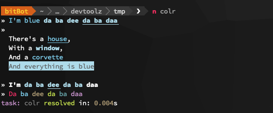

# colr


### Installation
```bash
$ npm install akileez\colr
```

### Usage
```js
const { red, blue, bold, underline, bbBlue, black, green, yellow, cyan, magenta } = require('colr')

log(
  blue(`I'm blue`),
  bold(blue('da ba dee')),
  underline(bold(blue('da ba daa')))
)

log(`
  There's a ${underline(blue('house'))},
  With a ${bold(blue('window'))},
  And a ${blue('corvette')}
  ${bbBlue(black('And everything is blue'))}
`)

log(bold(`I'm ${blue(`da ba ${underline('dee')} da ba`)} daa`))

log(`${red('Da')} ${blue('ba')} ${yellow('dee')} ${green('da')} ${cyan('ba')} ${magenta('daa')}`)
```


### Supported styles

| Colors  | Background Colors | Bright Colors | Bright Background Colors | Modifiers         |
| ------- | ----------------- | ------------- | ------------------------ | ----------------- |
| black   | bgBlack           | brBlack       | bbBlack            | dim               |
| red     | bgRed             | brRed         | bbRed              | **bold**          |
| green   | bgGreen           | brGreen       | bbGreen            | hidden            |
| yellow  | bgYellow          | brYellow      | bbYellow           | _italic_          |
| blue    | bgBlue            | brBlue        | bbBlue             | <u>underline</u>  |
| magenta | bgMagenta         | brMagenta     | bbMagenta          | ~~strikethrough~~ |
| cyan    | bgCyan            | brCyan        | bbCyan             | reset             |
| white   | bgWhite           | brWhite       | bbWhite            |                   |
| gray    | bgGray            | brGray        | bbGray             |                   |
| grey    | bgGrey            | brGrey        | bbGrey             |                   |

### API
```js

```

### Why?


### See Also
-

### License
[ISC](https://github.com/akileez/colr/blob/master/LICENSE)

